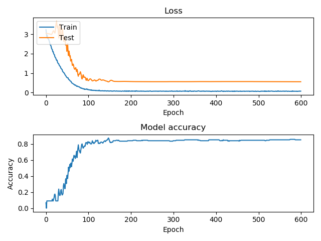
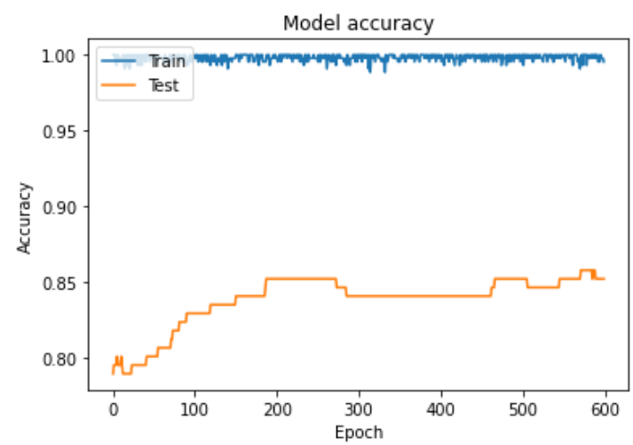

# DD-Net Pytorch

A pytorch reimplementation of [DD-Net](https://github.com/fandulu/DD-Net), which is a lightweight network for body/hand action recognition.

## How to use the code

A subset of preprocessd JHMDB data has been in this repo, which is `GT_test_1.pkl`,`GT_train_1.pkl`.

The code is written and tested in `Pytorch 1.3.0`.

```Python
git clone https://github.com/BlurryLight/DD-Net-Pytorch.git
python train.py --batch-size 512 --epochs 600 --lr 0.001 | tee train.log
```

## Performance

The number of parameters is the same with the the original Keres version, which is 1.80M in JHMDB.

The val performance is comparable to the original version. On the provided JHMDB split, the performance is as blow.

- The Pytorch version



- The Keres version

